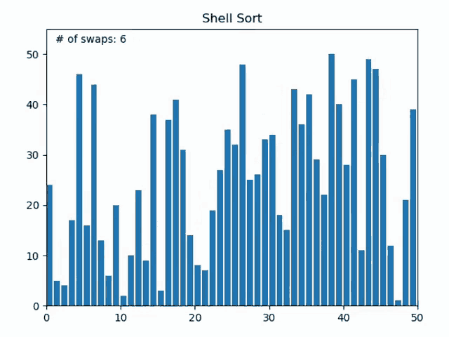

Métodos de Ordenamiento
================
Las metodos de ordenación son algoritmos que realizan la acción de ordenar los registros de una tabla en algún orden secuencial. Un grupo de datos se ordena según el valor de un determinado campo tambien es imporante mencionar que tanto la ordenación iterativa como la recursiva son posibles.

## 1 - BubbleSort
Funciona comparando cada elemento de la lista a ordenar con el inmediatamente posterior y el inmediatamente anterior, ajustando sus posiciones si están en orden incorrecto (n>n+1).
(n>>n+1) orden. Este procedimiento debe realizarse repetidamente hasta que no sea necesario realizar más ajustes, momento en el que se dice que la lista está ordenada.
está ordenada.
### Rendimiento.
Bubble Sort es especialmente deficiente cuando se trata de conjuntos de datos grandes. A medida que el tamaño del conjunto de datos aumenta, el algoritmo puede volverse considerablemente lento.

#### Grafico


Ejemplo JavaScript:

``` JavaScript
function bubbleSort(vectorbs) {
  // Imprimimos el vector obtenido al principio (Desordenado)
  console.log("El vector a ordenar es:", vectorbs);
  let n = vectorbs.length;

  // Iteramos sobre el vectorbs
  for (let i = 0; i < n - 1; i++) {
    // Iteramos sobre los elementos restantes en cada iteración
    for (let j = 0; j < n - i - 1; j++) {
      // Comparamos los elementos adyacentes
      if (vectorbs[j] > vectorbs[j + 1]) {
        // Intercambiamos los elementos si están en el orden incorrecto
        let temp = vectorbs[j];
        vectorbs[j] = vectorbs[j + 1];
        vectorbs[j + 1] = temp;
      }
    }
  }
  // Imprimimos el vector ordenado
  console.log("El vector ordenado por Bubble Sort es:", vectorbs);
}
let vectorbs = [64, 34, 25, 12, 22, 11, 90];
// Llamamos a la función bubbleSort pasando el vector a ordenar
bubbleSort(vectorbs);
```
## 3 - InsertionSort
El método de ordenamiento de inserción actua recorriendo la lista a ordenar, tomando el elemento actual e insertándolo donde debería comparandoló entre los que ya ha recorrido.
### Rendimiento
Inserción tiene una complejidad temporal óptima de cuando el vector está completamente ordenada, ya que sólo se necesita una comparación para cada elemento para confirmar que está en el lugar correcto.
Sin embargo, en el peor de los casos, cuando la matriz está ordenada en orden inverso, el proceso de inserción requiere comparar y desplazar cada elemento para colocarlo en su lugar correcto.
#### Grafico


``` JavaScript
function insertionSort(vectoris) {
  // Imprimimos el vector obtenido al principio (Desordenado)
  console.log("El vector a ordenar es:", vectoris);
  let n = vectoris.length;

  // Iteramos sobre el vectoris
  for (let i = 1; i < n; i++) {
    let current = vectoris[i];
    let j = i - 1;
    // Movemos los elementos del vectoris[0..i-1], que son mayores que la clave, a una posición adelante de su posición actual
    while (j > -1 && current < vectoris[j]) {
      vectoris[j + 1] = vectoris[j];
      j--;
    }
    vectoris[j + 1] = current;
  }
  // Imprimimos el vector ordenado
  console.log("El vector ordenado por Insertion Sort es:", vectoris);
}
let vectoris = [70, 50, 30, 10, 20, 40, 60];
// Llamamos a la función insertionSort pasando el vector a ordenar
insertionSort(vectoris);
```
## 4 - SelectionSort
Consiste en encontrar el elemento más pequeño entre todos los elementos desordenados, colocarlo al principio y repetir con los demás elementos (se ignoran los que ya están ordenados).

### Rendimiento
En términos de rendimiento práctico, el algoritmo de selección también tiende a funcionar bien para arreglos pequeños o casi ordenados, pero puede volverse ineficiente para arreglos grandes debido a su complejidad cuadrática
#### Grafico


``` JavaScript
function selectionSort(vectorss) {
  // Imprimimos el vector obtenido al principio (Desordenado)
  console.log("El vector a ordenar es:", vectorss);
  let n = vectorss.length;

  // Iteramos sobre el vectorss
  for (let i = 0; i < n - 1; i++) {
    // Encontramos el elemento mínimo en el vectorss sin ordenar
    let min = i;
    for (let j = i + 1; j < n; j++) {
      if (vectorss[j] < vectorss[min]) {
        min = j;
      }
    }
    // Intercambiamos el elemento mínimo encontrado con el primer elemento
    let temp = vectorss[min];
    vectorss[min] = vectorss[i];
    vectorss[i] = temp;
  }
  // Imprimimos el vector ordenado
  console.log("El vector ordenado por Selection Sort es:", vectorss);
}
let vectorss = [64, 25, 12, 22, 11];
// Llamamos a la función selectionSort pasando el vector a ordenar
selectionSort(vectorss);
```
## 5 - ShellSort
El Método Shell compara elementos separados por un espacio de varias posiciones, lo que permite a un elemento dar "pasos más grandes" hacia su posición esperada. Termina con una Ordenación por Inserción directa, que supone una mejora respecto al Método de Ordenación por Inserción porque el Método de Ordenación por Inserción es eficaz si la lista está casi ordenada.

### Rendimiento
es un algoritmo de ordenamiento que mejora el rendimiento del algoritmo de inserción mediante el uso de brechas para dividir el arreglo en subarreglos. Aunque su complejidad es mayor el Shell Sort suele ser más eficiente en la práctica para arreglos de tamaño moderado debido a su capacidad para mover elementos distantes más rápidamente.
#### Grafico


``` JavaScript
function shellSort(vectorsls) {
  // Imprimimos el vector obtenido al principio (Desordenado)
  console.log("El vector a ordenar es:", vectorsls);
  let n = vectorsls.length;

  // Inicializamos la brecha
  for (let gap = Math.floor(n / 2); gap > 0; gap = Math.floor(gap / 2)) {
    // Realizamos el ordenamiento por inserción
    for (let i = gap; i < n; i += 1) {
      let temp = vectorsls[i];
      let j;
      for (j = i; j >= gap && vectorsls[j - gap] > temp; j -= gap) {
        vectorsls[j] = vectorsls[j - gap];
      }
      vectorsls[j] = temp;
    }
  }
  // Imprimimos el vector ordenado
  console.log("El vector ordenado por Shell Sort es:", vectorsls);
}
let vectorsls = [12, 34, 54, 2, 3];
// Llamamos a la función bubbleSort pasando el vector a ordenar
shellSort(vectorsls);
```
## 6 - MergeSort
El algoritmo debe dividir la lista desordenada en dos sublistas de aproximadamente la mitad de su tamaño, ordenar cada sublista utilizando la ordenación por mezcla de forma recursiva y, a continuación, combinar las dos sublistas en una única lista ordenada. La ordenación por mezcla tiene un funcionamiento muy específico. Un dato importante esque debemos saber que si la longitud de la lista es 0 ó 1, ya está ordenada por defecto. En caso contrario, el algoritmo debe dividir la lista desordenada en dos sublistas.

### Rendimiento
Merge Sort es un algoritmo de ordenamiento eficiente y confiable aunque con una complejidad elevada, el mejor caso y el caso promedio. Es adecuado para arreglos grandes y secuencias de datos enlazados, y su rendimiento no se ve afectado por la distribución de los elementos.
#### Grafico


``` JavaScript
function mergeSort(vectorms) {
  let n = vectorms.length;

  // Si el vector tiene un solo elemento, lo devolvemos
  if (n === 1) {
    return vectorms;
  }

  // Encontramos el punto medio del vector
  const mid = Math.floor(n / 2);
  const left = vectorms.slice(0, mid);
  const right = vectorms.slice(mid);

  // Usamos la recursividad para combinar los dos vectores divididos
  return merge(mergeSort(left), mergeSort(right));
}

// Función para combinar dos vectores divididos
function merge(left, right) {
  let result = [];
  let i = 0;
  let j = 0;

  // Combinamos los dos vectores en uno
  while (i < left.length && j < right.length) {
    if (left[i] < right[j]) {
      result.push(left[i++]);
    } else {
      result.push(right[j++]);
    }
  }
  // Combinamos los vectores restantes
  return result.concat(left.slice(i)).concat(right.slice(j));
}

let vectorms = [12, 11, 13, 5, 6, 7];
// Imprimimos el vector obtenido al principio (Desordenado)
console.log("El vector a ordenar es:", vectorms);

// Llamamos a la función mergeSort pasando el vector a ordenar
console.log("El vector ordenado por Merge Sort es:", mergeSort(vectorms));
```
## 7 - QuickSort
Es un método de divide y vencerás que divide la matriz de entrada en torno a un elemento pivote que se elige. Existen numerosas variaciones de la ordenación rápida que seleccionan diversos pivotes.
El elemento inicial debe servir siempre de pivote.
El componente final debe ser siempre el pivote.
El pivote debe ser un componente aleatorio.
Decida pivotar en el medio.
La partición es el método utilizado en la ordenación rápida. Dada una matriz A y un elemento de la matriz designado como pivote, el objetivo del proceso es colocar x en la posición adecuada de la matriz ordenada y, al mismo tiempo, colocar todos los elementos que sean menores que x antes de x y todos los elementos que sean mayores que x después de x.
### Rendimiento
La complejidad de Quicksort lo convierte en un método generalmente eficaz pero tambien aveces dificil de comprender. Su rendimiento práctico se ve reforzado por la partición efectiva de la matriz y el menor consumo de memoria adicional en comparación con otros métodos de ordenación.
#### Grafico


``` JavaScript
function quickSort(vectormqs) {
  let n = vectormqs.length;

  // Si el vector tiene un solo elemento, lo devolvemos
  if (n < 2) {
    return vectormqs;
  }

  // Definimos el pivote
  const pivot = vectormqs[Math.floor(Math.random() * n)];

  // Definimos los vectores menores y mayores
  const less = vectormqs.filter((value) => value < pivot);
  const greater = vectormqs.filter((value) => value > pivot);

  // Usamos la recursividad para combinar los dos vectores divididos
  return [...quickSort(less), pivot, ...quickSort(greater)];
}

let vectormqs = [10, 7, 8, 9, 1, 5];
// Imprimimos el vector obtenido al principio (Desordenado)
console.log("El vector a ordenar es:", vectormqs);

// Llamamos a la función quickSort pasando el vector a ordenar
console.log("El vector ordenado por Quick Sort es:", quickSort(vectormqs));
``` 

